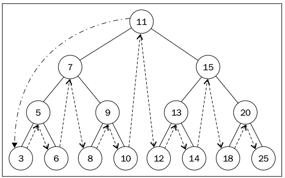
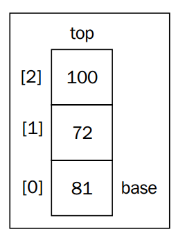
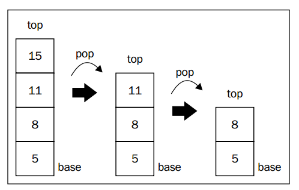

# Data structures

## Array

An array stores a sequence of values that are all of the same data type. Although JavaScript allows us to create arrays with values from different data types, we will follow the best practices and consider that we cannot do that (most languages do not have this capability).

In JavaScript, an array is a mutable object. We can easily add new elements to it. The object will grow dynamically as we add new elements to it. In many other languages, such as C and Java, we need to determine the size of the array, and if we need to add more elements to the array, we need to create a completely new array; we cannot simply add new elements to it as we need them.

i.e.:
```js
averageTemp[0] = 31.9;
averageTemp[1] = 35.3;
averageTemp[2] = 42.4;
averageTemp[3] = 52;
averageTemp[4] = 60.8;
```


## Linked lists

Linked lists store a sequential collection of elements; but unlike arrays, in linked lists the elements are not placed contiguously in memory. Each element consists of a node that stores the element itself and also a reference (also known as a pointer or link) that points to the next element. The following diagram exemplifies the structure of a linked list:


One of the benefits of a linked list over a conventional array is that we do not need to shift elements over when adding or removing elements. However, we need to use pointers when working with a linked list, and because of it, we need to pay some extra attention when implementing a linked list. Another detail in the array is that we can directly access any element at any position; with the linked list, if we want to access an element from the middle, we need to start from the beginning (**head**) and iterate the list until we find the desired element.

### Double linked list

The difference between a doubly linked list and a normal linked list is that in the linked list we make the link from one node to the next one only. In the doubly linked list, we have a double link: one for the next element and one for the previous element, as shown in the following diagram:


### Circular linked lists
A circular linked list can have only one reference direction (as the linked list) or a double reference as the doubly linked list. The only difference between the circular linked list and a linked list is that the last element's next ( tail.next ) pointer does not make a reference to null , but to the first element ( head ), as we can see in the following diagram:


### Hash Tables

A hash table (aka Hash Map) is a data structure that maps keys to values for highly efficient lookup. There are a number of ways of implementing this. Here, we will describe a simple but common implementation.

In this simple implementation, we use an **array** of **linked lists** and a hash code function. To insert a key (which might be a string or essentially any other data type) and value, we do the following:

1. First, compute the key's hash code, which will usually be an `int` or `long`. Note that two different keys could have the same hash code, as there may be an infinite number of keys and a finite number of ints.
2. Then, map the hash code to an index in the array. This could be done with something like `hash (key) % array_length`. Two different hash codes could, of course, map to the same index.
3. At this index, there is a linked list of keys and values. Store the key and value in this index. We must use a linked list because ofcollisions: you could have two different keys with the same hash code, or two different hash codes that map to the same index.

To retrieve the value pair by its key, you repeat this process. Compute the hash code from the key, and then compute the index from the hash code. Then, search through the linked list for the value with this key.

If the number of collisions is very high, the worst case runtime is O(N), where N is the number of keys. However, we generally assume a good implementation that keeps collisions to a minimum, in which case the lookup time is O(1)


## Trees

A tree consists of nodes with a parent-child relationship. Each node has a parent (except for the first node at the top) and zero or more children:


The top node of a tree is called the **root** (**11**). It is the node that does not have a parent. Each element of the tree is called node. There are internal nodes and external nodes. An internal node is a node with at least one child (**7, 5, 9, 15, 13**, and **20** are internal nodes). A node that does not have children is called an external node or leaf (**3, 6, 8, 10, 12, 14, 18**, and **25** are leaves).

A node can have ancestors and descendants. The ancestors of a node (except the root) are parent, grandparent, great-grandparent, and so on. The descendants of a node are child, grandchild, great-grandchild, and so on. For example, node **5** has **7** and **11** as its ancestors and 3 and 6 as its descendants.

Another terminology used with trees is the subtree. A subtree consists of a node and its descendants. For example, nodes **13, 12**, and **14** consist a subtree of the tree from the preceding diagram.

The depth of a node consists of the number of ancestors. For example, node 3 has depth 3 because it has 3 ancestors (**5, 7**, and **11**).

The height of a tree consists of the maximum depth of any node. A tree can also be broken down into levels. The root is on level 0, its children are on level 1, and so on. The tree from the preceding diagram has height 3 (maximum depth is 3 as shown in the preceding figure—level 3).

### Binary tree and binary search tree

A node in a binary tree has at most two children: one left child and one right child. This definition allows us to write more efficient algorithms for inserting, searching, and deleting nodes to/from a tree.

A binary search tree is a binary tree, but it only allows you to store nodes with lesser values on the left side and nodes with greater values on the right side. The diagram in the previous topic exemplifies a binary search tree.

The following diagram exemplifies how our **Binary Search Tree** (**BST**) will be organized in terms of data structure:


Just like in linked lists, we will work with pointers again to represent the connection between the nodes (called **edges** in tree terminology). When we worked with double linked lists, each node had two pointers: one to indicate the next node and another one to indicate the previous node. With trees one pointer points to the left child, and the other one to the right child.

#### Tree traversal
Traversing (or walking) a tree is the process of visiting all nodes of a tree and performing an operation at each node. But how should we do that? Should we start from the top of the tree or from the bottom? From the left or the right side? There are three different approaches that can be used to visit all the nodes in a tree: in-order, pre-order, and post-order.

* **In-order traversal**

  An in-order traversal visits all the nodes of a BST in ascending order, meaning it visits the nodes from the smallest to largest. An application of in-order traversal
would be to sort a tree. The inOrderTraverse method receives a callback function as a parameter. This function can be used to perform the action we would like to execute when the node is visited (this is known as **the visitor** pattern).

This would be the node order: 3 5 6 7 8 9 10 11 12 13 14 15 18 20 25




* **Pre-order traversal**

A pre-order traversal visits the node prior to its descendants. An application of pre-order traversal could be to print a structured document.

This would be the node order: 11 7 5 3 6 9 8 10 15 13 12 14 20 18 25


* **Post-order traversal**

A post-order traversal visits the node after it visits its descendants. An application of post-order could be computing the space used by a file in a directory and its subdirectories.

This would be the node order: 3 6 5 8 10 9 7 12 14 13 18 25 20 15 11


#### Removing a node

* **Removing a leaf node**


* **Removing a node with a left or right child**


* **Removing a node with two children**


## Stacks

As you learned, we can add and remove elements from an array at any index desired. However, sometimes we need some form of data structure where we have more control over adding and removing items. There are two data structures that have some similarities to arrays but give us more control over the addition and removal of elements. These data structures are stacks and queues

### Stack

A stack is an ordered collection of items that follows the **LIFO** (short for **Last In First Out**) principle. The addition of new items or the removal of existing items takes place at the same end. The end of the stack is known as the top and the opposite is known as the base. The newest elements are near the top, and the oldest elements are near the base.



#### Push

One of the most important method from a stack is the push one. This method will be responsible for adding new elements to the stack with one very important detail: we can only add new items to the top of the stack, meaning at the end of the stack.


#### Pop

The other important method is the pop one. This method will be responsible for removing the items from the stack. As the stack uses the LIFO principle, the last item that we added is the one that is removed.




